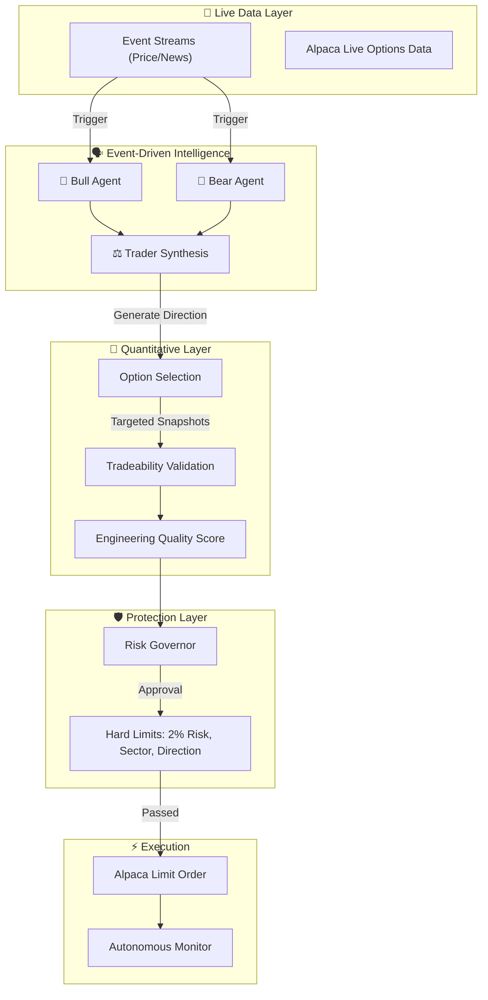

<div align="center">
  

# 🛡️ AegisAlpha
**Autonomous Event-Driven Options Agent powered by Google Gemini & Alpaca**

[](https://www.python.org/downloads/)
[](https://alpaca.markets/)
[](https://deepmind.google/technologies/gemini/)
[](https://opensource.org/licenses/MIT)

*AI Proposes. Data Informs. Risk Governs. Code Executes.*

</div>

---

## 📖 What is AegisAlpha?

**AegisAlpha** is an advanced, fully autonomous options trading agent. It bridges the reasoning capabilities of **Google Gemini** with the execution power of the **Alpaca Brokerage**. 

Unlike naive LLM trading bots that blindly buy based on sentiment, AegisAlpha implements a **strict separation of concerns**. It uses independent LLM roles (Bull vs. Bear) to debate an asset's direction, quantitatively scores opportunities using an Engineering Quality Score, and routes every decision through a **Deterministic Risk Governor** that enforces hard portfolio limits before execution. 

---

## 🧩 Why AegisAlpha is Different

Most AI trading bots have one critical weakness: the same model that interprets market information may also influence position sizing, probabilities, and execution.

AegisAlpha separates those responsibilities to guarantee safety.

- **AI proposes** the directional thesis.
- **Data informs** the quantitative metrics and Tradeability Validation.
- **Risk governs** the deterministic boundaries.
- **Code executes** only after every hard constraint passes.

This architecture ensures the agent rejects low-quality signals, resizes valid opportunities dynamically, and definitively chooses not to trade when the risk profile is unacceptable.

---

## 🧠 Architecture Pipeline

AegisAlpha's core pipeline operates on a strict, unbreakable sequence:

`EVENT → DATA → BULL + BEAR → TRADER → OPTION → RANK → RISK → EXECUTE → MONITOR`



---

## ✨ Core Mechanics

### ⚡ Event-Driven Intelligence
AegisAlpha relies on **zero polling**. The pipeline only evaluates a stock if triggered by a live event (e.g., a real-time price spike > 0.5% or breaking news via Alpaca Data Streams). 

### ⚖️ Bull / Bear Reasoning
When triggered, AegisAlpha spins up two parallel Gemini contexts: a Bull and a Bear. They each parse the exact same market event and construct opposing theses. A third "Trader" agent evaluates the debate to produce a final directional synthesis.

### 🛡️ Tradeability Validation
If the Trader finds a signal, the system pulls live Alpaca Option Snapshots. It performs strict, deterministic quantitative checks (Bid/Ask spread limits, Open Interest > 10, DTE ranges). If a metric like Implied Volatility or Greeks is missing from the exchange, AegisAlpha fails closed and marks it `UNAVAILABLE`—it **never fabricates data**.

### 🏆 Engineering Quality Score
Valid options are ranked deterministically from 0–100. **This is an Engineering Quality Score, not a prediction of profitability.** It is an objective composite of AI Confidence (40%), Market Volatility Context (20%), Option Delta proximity to ATM (20%), and Liquidity/Spread (20%). It ensures the system only targets high-quality structural setups.

### 🛑 Deterministic Risk Governor
A strong AI conviction means nothing if the math doesn't align. The Risk Governor enforces strict, hardcoded limits: max 2% total equity risk per trade, sector concentration caps, and total directional exposure limits. The LLM cannot bypass this logic.

### 🗂️ Decision Journal & Explainability
Every decision—whether it resulted in a trade or not—is logged transparently.
* **Counterfactuals (What-Ifs):** Rejected valid opportunities (e.g., vetoed by Risk, low Engineering Quality Score, or illiquid options) are securely logged but strictly isolated. They do not contaminate live P&L statistics.
* **System Failures:** API timeouts (AI UNAVAILABLE) or stale data correctly abort the pipeline without masquerading as valid trading logic.

---

## 📊 Dashboard & Observability

AegisAlpha includes a premium Streamlit dashboard to provide live, read-only observability of the agent.

The dashboard cleanly separates:
* **🔴 LIVE EXECUTIONS:** Actual trades submitted to Alpaca Paper Trading.
* **🟡 COUNTERFACTUALS (WHAT-IF):** Safely rejected opportunities and AI logic paths that did not execute.
* **⚙️ SYSTEM FAILURES:** Aborted evaluations due to API or data errors.

*Note: The dashboard strictly monitors real Alpaca paper activity. No fake statistics, simulated fills, or fabricated performance numbers are displayed.*

---

## 🛠️ Testing & Safety Philosophy

AegisAlpha is heavily tested with an uncompromising safety philosophy. 

**Test Baseline:** 53 / 53 Passing Tests

Safety Assertions Guaranteed:
* Gemini reasoning failures fail-closed immediately (AI UNAVAILABLE).
* Counterfactual records explicitly cannot influence Live Execution Statistics.
* Deterministic Risk rejections mathematically cannot reach the Alpaca order execution layer.

---

## 🚀 Setup & Installation

### Requirements
* Python 3.10+
* Alpaca Paper Trading Account
* Google Gemini API Key

### Configuration
1. Clone the repository and install dependencies:
   ```bash
   pip install -r requirements.txt
   ```
2. Copy the environment template:
   ```bash
   cp .env.example .env
   ```
3. Edit `.env` to include your:
   - `APCA_API_KEY_ID`
   - `APCA_API_SECRET_KEY`
   - `GEMINI_API_KEY`

### Running the Agent Locally

AegisAlpha is strictly a **Demo Mode / Simulation Only** paper-trading application.

1. **Start the Autonomous Agent:**
   ```bash
   python main.py
   ```
2. **Start the Live Dashboard (Optional, separate terminal):**
   ```bash
   streamlit run dashboard.py
   ```

---

## 🌐 Cloud Deployment

The repository includes a `render.yaml` for zero-cost deployment as two separate background services:
1. **Web Service (Dashboard):** Runs the Streamlit UI on `$PORT`.
2. **Background Worker:** Runs `main.py` continuously.

---
<div align="center">
<i>Built for the Alpaca Hackathon 2026</i>
</div>
