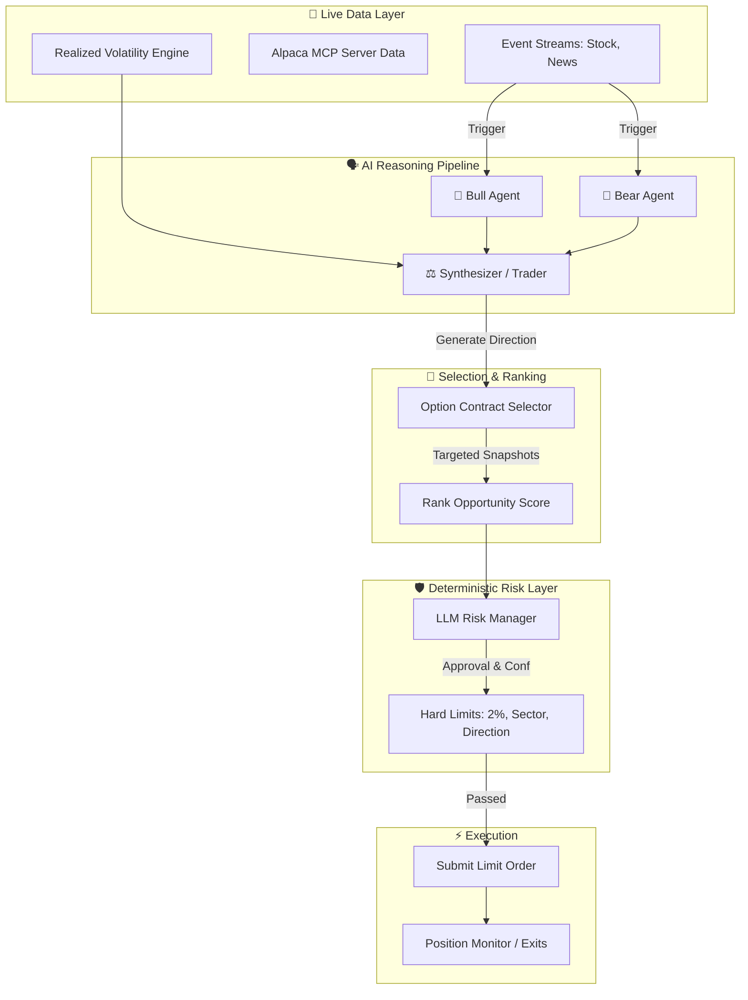

<div align="center">
  

# 🛡️ AegisAlpha
**Autonomous Event-Driven Options Agent powered by Claude 3.5 Sonnet & Alpaca**

[](https://www.python.org/downloads/)
[](https://alpaca.markets/)
[](https://www.anthropic.com/)
[](https://opensource.org/licenses/MIT)

*AI Proposes. Data Informs. Risk Governs. Code Executes.*

</div>

---

## 📖 Overview

**AegisAlpha** is an advanced, fully autonomous options trading agent. It bridges the reasoning capabilities of **Claude 3.5 Sonnet** with the execution power of the **Alpaca Brokerage**. 

Unlike naive LLM trading bots that blindly buy based on sentiment, AegisAlpha implements a **strict separation of concerns**. It uses independent LLM roles (Bull vs. Bear) to debate an asset's direction, scores opportunities based on live volatility regimes, and routes every decision through a **deterministic risk engine** that enforces hard portfolio limits before execution. 

---

## 🧩 Why AegisAlpha?

Most AI trading bots have one critical weakness: the same model that interprets market information may also influence position sizing and execution.

AegisAlpha separates those responsibilities.

- **AI reasons** about opportunities.
- **Market data informs** the decision.
- **Deterministic code enforces** risk boundaries.
- **Alpaca executes** only after every hard constraint passes.

This architecture allows the agent to reject low-quality signals, resize valid opportunities, and choose not to trade when the risk profile is unacceptable.

---

## ✨ Key Differentiators

* ⚖️ **Adversarial Reasoning**: Dedicated LLM instances build competing bull and bear cases to reduce confirmation bias.
* ⚡ **Event-Triggered Architecture**: Execution loops are strictly driven by live market data and breaking news—no blind polling.
* 🛡️ **Deterministic Risk Controls**: A strong AI conviction means nothing if the math doesn't align. Opportunities are rejected if they breach rigid account limits (e.g., max 2% equity risk).
* 📊 **Portfolio Protection**: Enforces sector diversification and caps directional (long/short) exposure.
* 🎯 **Option-Quality Filtering**: Automatically targets optimal DTE, high liquidity, tight spreads, and volume.
* 🔒 **Limit-Order Execution**: Rejects slippage by enforcing strict limit orders based on real-time bid/ask snapshots.
* 🔄 **Autonomous Exits & NO-TRADE Decisions**: Capable of actively deciding *not* to trade, and manages open positions proactively in background loops.

---

## 🚀 Official Alpaca MCP Server Integration

AegisAlpha proudly integrates the **Official Alpaca Model Context Protocol (MCP) Server** to provide its AI agents with secure, standardized access to brokerage capabilities. 

This integration operates strictly within the `alpaca-py` deterministic runtime environment. By relying on the official MCP standard rather than fragile local wrapper proxies, AegisAlpha ensures high-fidelity, secure, and fully compliant execution of account monitoring, limit orders, and market state reconciliation.

---

## 🧠 Architecture

The central thesis of AegisAlpha is that LLMs are excellent at synthesizing complex unstructured data, but terrible at deterministic math. AegisAlpha solves this by keeping the AI strictly in the "proposal" layer.



### The Autonomous Loop
1. **Market / News Events** trigger the pipeline.
2. **Bull & Bear** agents synthesize the data independently.
3. **Trader** reviews the debate and makes a directional call.
4. **Opportunity Ranking** scores the setup against current Volatility Regimes.
5. **Risk Manager** checks macroeconomic context.
6. **Deterministic Risk Engine** blocks trades that violate hard rules.
7. **Alpaca Paper Execution** executes safe limit orders.
8. **Position Monitoring** autonomously exits for profit/loss.

---

## 🔎 Worked Decision Example 

*The following trace demonstrates the internal decision loop. The numbers are realistic examples of the agent's live logging process.*

> **📡 Market Event**: Price spike on AAPL detected (1.5% move in 2 minutes)  
> **📊 Data Gathered**: 180 days history, 20-day Realized Vol = 18%, Regime = NORMAL  
> **🐂 Bull Case**: Moving average breakout supported by tech sector strength.  
> **🐻 Bear Case**: Resistance level overhead; potential exhaustion.  
> **⚖️ Trader Synthesis**: Agrees with Bull case given favorable volume trend. Direction: Call.  
> **🎯 Confidence**: Initial Confidence: 0.85  
> **📜 Option Selection**: AAPL 14 DTE, 50-delta Call selected. Spread is $0.05.  
> **🏆 Rank Score**: Scored at 75.0 (Passes absolute minimum threshold of 60.0).  
> **🛡️ Risk Checks**: Risk Manager Approves. Hard limits verify sector exposure is below 15% and trade risk is < 2% equity.  
> **⚡ Order**: Buy 3 AAPL Calls at $1.50 Limit.  
> **✅ Fill**: Order filled via Alpaca paper execution.  
> **🔄 Monitoring**: Monitored in autonomous background loop.  
> **🚪 Exit**: Option hits +25% profit target; limit order submitted to sell.  
> **💰 P&L**: +$112.50 Realized.  

---

## 📈 Live Performance Tracking

> **Performance status**: ⏳ *Awaiting live scoring-session results*

*(This section is reserved for the actual Alpaca account results following the first real market scoring session on Monday. It will be updated with verifiable starting/ending equity, total P&L, trade counts, max drawdown, and win/loss behavior.)*

---

## 🎥 Demo Video Workflow

The accompanying demonstration video showcases the live autonomous system in action, specifically highlighting:
1. Agent initialization and `PAPER` mode verification.
2. A live market/news event triggering the pipeline.
3. The independent Bull/Bear reasoning logs.
4. Optimal Option selection via Alpaca targeted snapshots.
5. A trade being **rejected** by the risk layer to demonstrate safety.
6. A valid trade passing limits and submitting a Paper Limit Order.
7. Fill reconciliation and background position monitoring.

---

## 🛠️ Setup & Installation

### Requirements
* Python 3.10+
* Alpaca Paper Trading Account
* Anthropic API Key (Claude 3.5 Sonnet)

### Quick Start

1. **Clone the repository:**
   ```bash
   git clone https://github.com/yourusername/aegis-alpha.git
   cd aegis-alpha
   ```

2. **Set up virtual environment:**
   ```bash
   python -m venv venv
   source venv/bin/activate  # On Windows use `venv\Scripts\activate`
   pip install -r requirements.txt
   ```

3. **Configure Environment:**
   Copy the example environment file and add your actual keys:
   ```bash
   cp .env.example .env
   ```
   *Edit `.env` to include your `APCA_API_KEY_ID`, `APCA_API_SECRET_KEY`, and `ANTHROPIC_API_KEY`.*

---

## 🌐 Live Demo Deployment

The AegisAlpha project includes a professional web dashboard built with Streamlit. The dashboard provides read-only, real-time insights into the agent's performance, positions, and decision pipeline.

### Deployment Options

The included `render.yaml` supports simple deployment to Render as two separate services:
1. **Web Service (Dashboard):** Runs the Streamlit dashboard on `$PORT`.
2. **Background Worker:** Runs the `main.py` autonomous trading agent continuously.

**To deploy:**
1. Connect your repository to Render.
2. Select "Blueprint" deployment and point to `render.yaml`.
3. Provide your environment variables when prompted.

### Running the Dashboard Locally

If you want to view the dashboard locally while your agent runs:
```bash
# In terminal 1 (starts the agent)
python main.py

# In terminal 2 (starts the dashboard)
streamlit run dashboard.py
```
Open `http://localhost:8501` to view your live stats.

---

## 🚀 Usage

To begin the autonomous trading session:
1. Verify `.env` contains the correct Official Paper Credentials.
2. Confirm `PAPER=True` in `config/settings.py`.
3. Run the autonomous loop:
   ```bash
   python main.py
   ```
4. Verify the startup logs, preflight completion, and data stream connections.
5. **Hands Off:** The agent will run autonomously and manage positions strictly according to its deterministic risk profile.

---
<div align="center">
<i>Built for the Alpaca Hackathon 2026</i>
</div>
