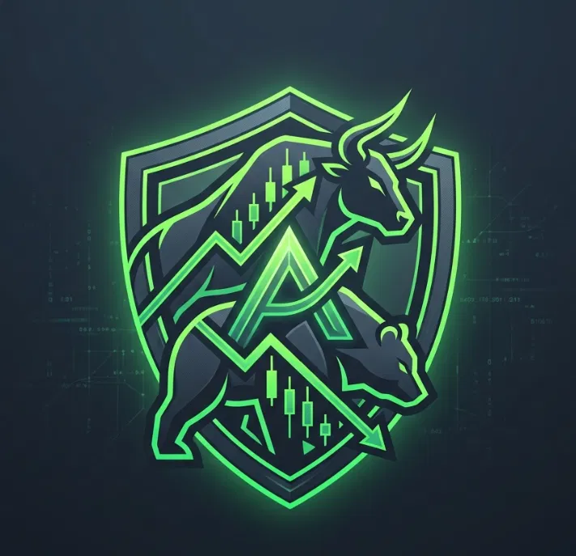
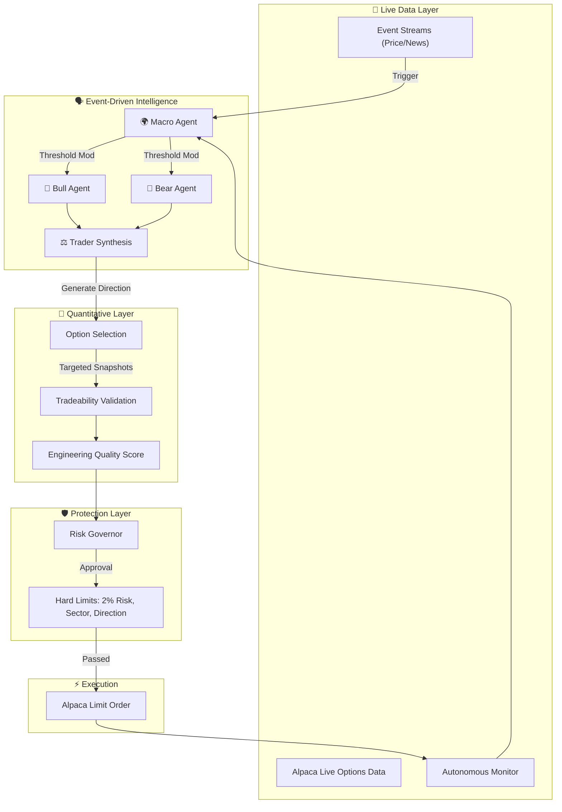

<div align="center">
  

# 🛡️ AegisAlpha
**Autonomous Event-Driven Options Agent powered by Google Groq & Alpaca**

[](https://www.python.org/downloads/)
[](https://alpaca.markets/)
[](https://groq.com/)
[](https://opensource.org/licenses/MIT)

*AegisAlpha is a Tier 4 autonomous trading pipeline that leverages multi-agent AI and deterministic risk governance to turn real-time market catalysts into executed options trades via Alpaca.*

</div>

---

## 📖 What is AegisAlpha?

**AegisAlpha** is an autonomous, event-driven options trading agent built for the Alpaca AI Trading Agents Hackathon. 

Instead of blindly polling an AI to guess market directions on a static watchlist, AegisAlpha utilizes a **Tier 4 Autonomous AI Screener** to actively hunt for meaningful market catalysts. When a significant event is detected, the pipeline triggers a high-speed, multi-agent debate (powered by Groq). Independent "Bull" and "Bear" AI agents gather real-time market data and synthesize opposing arguments before a final "Trader" agent forms a concrete trading thesis.

The agent then selects and validates a specific options contract using quantitative factors—such as liquidity, spread, DTE, Greeks, Implied Volatility, and pricing—before assigning a transparent 0–100 Opportunity Score.

Most importantly, **AI does not control risk.** A deterministic Python Risk Governor acts as an absolute circuit breaker. It enforces hard position limits, drawdown protection, PDT compliance, exposure limits, liquidity checks, and slippage protection. Even if the AI is overwhelmingly confident and wants to trade, the Risk Governor has the final authority to say NO.

Approved paper trades are executed flawlessly through Alpaca and managed automatically via dynamic trailing stops. Every single step of this pipeline—including the AI's internal reasoning, counterfactual rejections, and system vetoes—is broadcast in real-time to a premium, institutional-grade **Observability Dashboard (The Decision Journal)**. 

*AI proposes. Data informs. Risk governs. Code executes.*

AegisAlpha is not designed to predict markets with certainty. It is designed to make autonomous trading decisions explainable, strictly controlled, and highly survivable.

---

## 🧩 Why AegisAlpha is Different

Most AI trading bots have one critical weakness: the same model that interprets market information may also influence position sizing, probabilities, and execution.

AegisAlpha separates those responsibilities to guarantee safety.

- **AI proposes** the directional thesis.
- **Data informs** the quantitative metrics and Tradeability Validation.
- **Risk governs** the deterministic boundaries.
- **Code executes** only after every hard constraint passes.

This architecture ensures the agent rejects low-quality signals, resizes valid opportunities dynamically, and definitively chooses not to trade when the risk profile is unacceptable.

---

## 🧠 Architecture Pipeline

AegisAlpha's core pipeline operates on a strict, unbreakable sequence:

`EVENT → DATA → MACRO → BULL + BEAR → TRADER → OPTION → RANK → RISK → EXECUTE → MONITOR`



---

## ✨ Core Mechanics

### ⚡ Tier 4 Autonomous AI Screener
AegisAlpha does not trade a static list. The agent actively scores live market catalysts, scraping news and momentum metrics to dynamically construct and refresh its own watchlist.

### 🌍 Macro Pre-Screener
Before diving into a specific stock, a dedicated **Macro Agent** analyzes the broader market context (e.g., SPY historical volatility). If the macro environment is crashing or excessively volatile, it dynamically raises the confidence threshold required for the system to approve bullish trades.

### ⚖️ Adversarial AI Reasoning (Bull vs Bear)
When triggered, AegisAlpha spins up two parallel Groq contexts: a Bull and a Bear. They each parse the exact same market event and construct opposing theses. A third "Trader" agent evaluates the debate to produce a final directional synthesis, effectively eliminating AI hallucination traps.

### 🏆 Engineering Quality Score
Valid options are ranked deterministically from 0–100. **This is an Engineering Quality Score, not a prediction of profitability.** It is an objective composite of AI Confidence (30%), Market Volatility Context (15%), Option Delta proximity to ATM (20%), Liquidity/Spread (20%), and **Implied Volatility Advantage** (15%). 

### 🛑 Deterministic Risk Governance
A strong AI conviction means nothing if the math doesn't align. The Risk Governor enforces strict, hardcoded limits: max 2% total equity risk per trade, sector concentration caps, and total directional exposure limits. The LLM cannot bypass this logic.

### 🗂️ Decision Journal & Explainability
Every decision—whether it resulted in a trade or not—is logged transparently.
* **Counterfactuals (What-Ifs):** Rejected valid opportunities (e.g., vetoed by Risk, low Engineering Quality Score, or illiquid options) are securely logged but strictly isolated. 
* **System Failures:** API timeouts (AI UNAVAILABLE) or stale data correctly abort the pipeline without masquerading as valid trading logic.

---

## 📊 The Decision Journal (UI Dashboard)

AegisAlpha includes a premium Streamlit dashboard to provide live, read-only observability of the agent's internal state.

The dashboard cleanly separates:
* **🔴 LIVE EXECUTIONS:** Actual trades submitted to Alpaca Paper Trading, along with a live **Execution Agent Panel** showing dynamic trailing stop levels.
* **🟡 COUNTERFACTUALS (WHAT-IF):** Safely rejected opportunities and AI logic paths that did not execute.
* **⚙️ SYSTEM FAILURES:** Aborted evaluations due to API or data errors.

Every Decision Journal entry features an interactive **Chain of Thought Expander**, allowing you to peek into the exact Bull and Bear arguments the LLMs debated before making a decision. 

---

## 🚀 Setup & Installation

### Requirements
* Python 3.10+
* Alpaca Paper Trading Account
* Google Groq API Key

### Configuration
1. Clone the repository and install dependencies:
   ```bash
   pip install -r requirements.txt
   ```
2. Copy the environment template:
   ```bash
   cp .env.example .env
   ```
3. Edit `.env` to include your:
   - `APCA_API_KEY_ID`
   - `APCA_API_SECRET_KEY`
   - `GROQ_API_KEY`

### Running the Agent Locally

1. **Start the Autonomous Agent (Backend):**
   ```bash
   python main.py
   ```
2. **Start the Live Dashboard (Frontend):**
   ```bash
   streamlit run dashboard.py
   ```

### The Cinematic Demo Simulator 🟡
AegisAlpha includes a specialized `Demo Mode` built directly into the UI.
Rather than waiting for unpredictable live market hours during a pitch, toggling "Demo Simulator" triggers a fully choreographed, high-fidelity presentation sequence. It dynamically generates randomized P&L mock data, walks the audience through the 3-phase AI reasoning pipeline, and smoothly auto-scrolls the Decision Journal to perfectly demonstrate the architecture in exactly 10 seconds.

---

## 🌐 Cloud Deployment

The repository includes a `render.yaml` for zero-cost deployment as two separate background services:
1. **Web Service (Dashboard):** Runs the Streamlit UI on `$PORT`.
2. **Background Worker:** Runs `main.py` continuously.

---
<div align="center">
<i>Built for the Alpaca Hackathon 2026</i>
</div>
